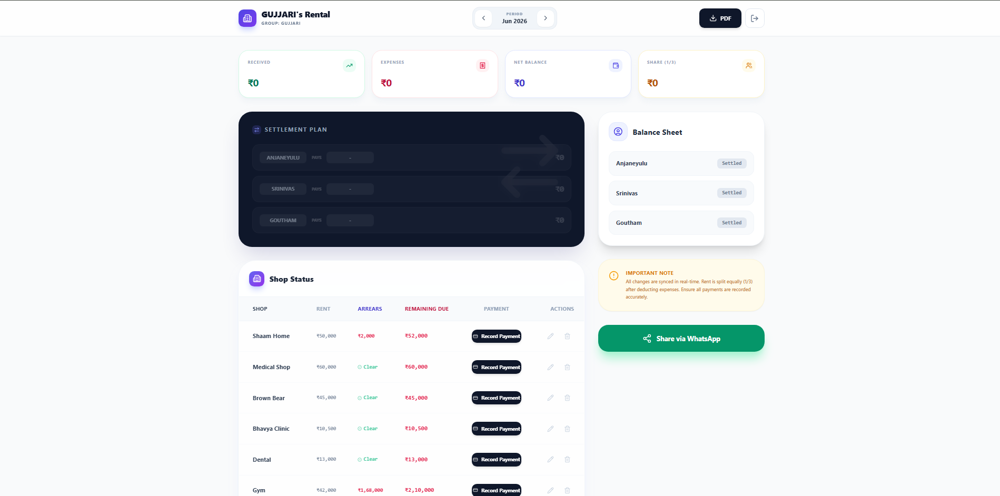
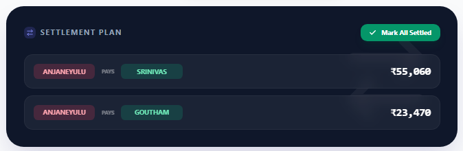
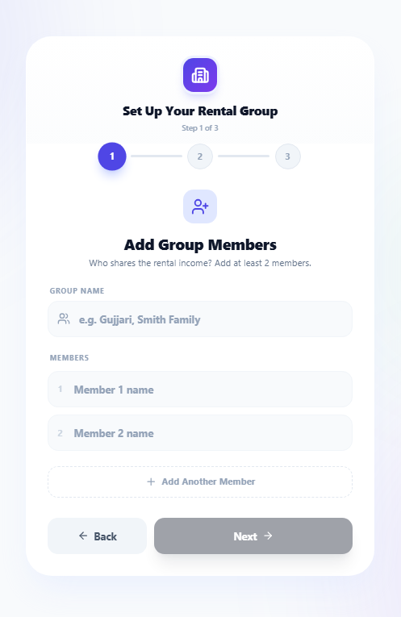

# 🏪 Rental Management System

> *Built to solve a real family problem — no more notebooks, no more calculation errors.*

<div align="center">


**[🌐 Live Demo](https://rental-management-system-five.vercel.app)** · **[📱 Download APK](https://github.com/sriteja123gujjari/rental-management-system/releases)** · **[🐛 Report Bug](https://github.com/sriteja123gujjari/rental-management-system/issues)**

</div>

---

## 📖 The Story Behind It

My family owns multiple rented shops. For years we tracked everything in **paper notebooks** — rent collections, shared expenses, who paid what. Every month-end meant arguments over calculations: *"Did you account for the electricity bill? Who collected from the dental shop?"*

I built this app to fix that. Every rupee is now tracked in real time, split fairly, and accessible on anyone's phone.

---

## ✨ Features

| Feature | Description |
|---|---|
| 🏠 **Multi-Shop Management** | Add, edit, and track unlimited rental properties |
| 💰 **Auto-Split Settlements** | Rent & expenses divided equally; calculates exactly who pays whom |
| 📅 **Month-wise History** | Navigate any past month with full data intact |
| ⚠️ **Arrears Tracking** | Automatically flags shops with overdue rent from previous months |
| 👻 **Ghost Shops** | Deleted shops still appear correctly in historical records |
| 📄 **PDF Reports** | One-tap monthly report — shareable directly via WhatsApp |
| 🔐 **Google OAuth** | Sign in with Google; new users get a guided 3-step onboarding |
| 📱 **Android APK** | Native Android app built with Capacitor |
| ☁️ **Real-time Sync** | All changes sync instantly via Supabase |

---

## 🖼️ Screenshots

> *(Add screenshots here — see the [screenshots guide](#-adding-screenshots) below)*

| Dashboard | Settlement Plan | Setup Flow |
|---|---|---|
|  |  |  |

---

## 🛠️ Tech Stack

```
Frontend    →  React 19 + TypeScript + Tailwind CSS + Lucide Icons
Backend     →  Supabase (PostgreSQL + Auth + RLS)
Build Tool  →  Vite
Mobile      →  Capacitor (Android APK)
PDF Engine  →  jsPDF + jsPDF-AutoTable
Deployment  →  Vercel (Web) + GitHub Releases (APK)
```

---

## 🗄️ Database Schema

```sql
shops            — name, base_rent, month, family_id
rent_records     — shop_id, amount_paid, collected_by, status, is_settled, family_id
expenses         — description, amount, paid_by, is_settled, month, family_id
user_preferences — user_id, family_id, members[], predefined_expenses[], setup_complete
```

---

## 🚀 Getting Started

### Prerequisites
- Node.js ≥ 18
- A [Supabase](https://supabase.com) project

### 1. Clone & Install

```bash
git clone https://github.com/sriteja123gujjari/rental-management-system.git
cd rental-management-system
npm install
```

### 2. Environment Setup

```bash
cp .env.example .env.local
```

Fill in your Supabase credentials:

```env
VITE_SUPABASE_URL=https://your-project.supabase.co
VITE_SUPABASE_ANON_KEY=your-anon-key-here
```

### 3. Supabase Setup

Run these SQL migrations in your Supabase SQL editor:

<details>
<summary>📋 Click to expand SQL schema</summary>

```sql
-- Shops table
create table shops (
  id uuid default gen_random_uuid() primary key,
  name text not null,
  base_rent numeric not null,
  month text not null,
  family_id text not null,
  created_at timestamptz default now()
);

-- Rent records
create table rent_records (
  id uuid default gen_random_uuid() primary key,
  shop_id uuid references shops(id),
  month text not null,
  amount_paid numeric not null,
  collected_by text,
  status text default 'Paid',
  is_settled boolean default false,
  family_id text not null
);

-- Expenses
create table expenses (
  id uuid default gen_random_uuid() primary key,
  description text not null,
  amount numeric not null,
  paid_by text not null,
  month text not null,
  is_settled boolean default false,
  family_id text not null,
  created_at timestamptz default now()
);

-- User preferences (onboarding data)
create table user_preferences (
  id uuid default gen_random_uuid() primary key,
  user_id uuid not null,
  family_id text not null,
  members text[] not null,
  predefined_expenses text[] not null,
  setup_complete boolean default false,
  updated_at timestamptz default now(),
  unique(user_id, family_id)
);

-- Enable Row Level Security
alter table shops enable row level security;
alter table rent_records enable row level security;
alter table expenses enable row level security;
alter table user_preferences enable row level security;
```

</details>

### 4. Run Locally

```bash
npm run dev
# → http://localhost:3000
```

### 5. Build for Production

```bash
npm run build
```

---

## 📱 Android APK Build

```bash
npm run build
npx cap sync android
npx cap open android
# Then build → Generate Signed APK in Android Studio
```

---

## 📸 Adding Screenshots

1. Create a `screenshots/` folder in the project root
2. Take screenshots from the live demo
3. Name them: `dashboard.png`, `settlement.png`, `setup.png`
4. Update the table in the Screenshots section above

---

## 🤝 Contributing

This is a personal/family project but PRs are welcome for:
- Bug fixes
- UI improvements
- New features (currency formatting, multi-language, etc.)

---

## 📄 License

MIT License — feel free to fork and adapt for your own family's needs.

---

<div align="center">

Built with ❤️ by **Sri Teja Gujjari** · ECE Student @ IARE Hyderabad

*"The best projects are the ones that solve real problems."*

</div>
